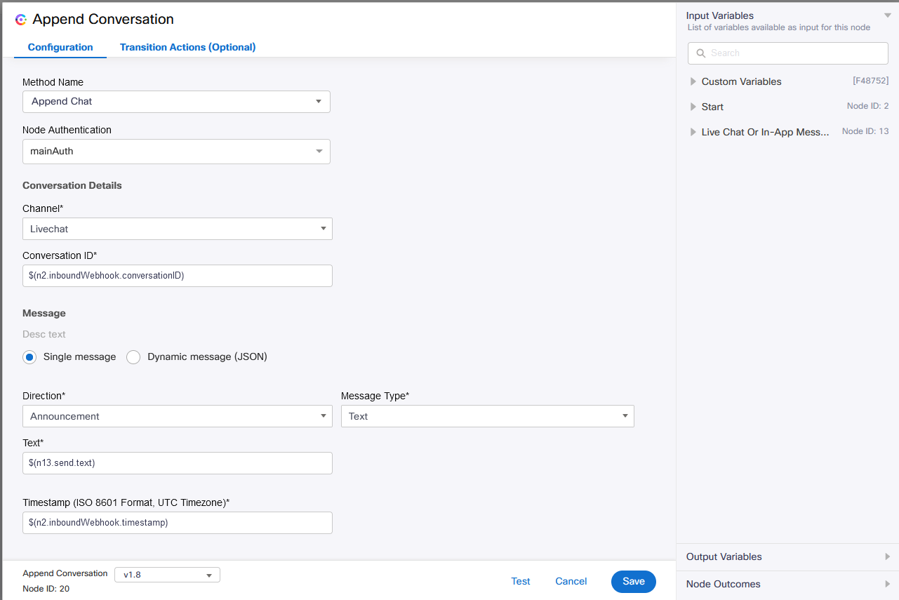

# response-timer


## Add a Set Variable node to your inbound chat flow before the Queue Contact node
> Method Name: Set Flow Variable
>
> Task ID: `$(taskId)`
>
> Variable 1:
>> Name: `Threadid`
>>
>> Type: String
>>
>> Value: `$(n2.inappmessaging.threadId`
>>
>> Make agent viewable : True
>> 
>> Desktop Label: any (not empty)
>
> Variable 2:
>> Name: `UserId`
>>
>> Type: String
>>
>> Value: `$(n2.inappmessaging.userId)`
>>
>> Make agent viewable : True
>> 
>> Desktop Label: any (not empty)
>
> Save and Publish
> 
> ---

## Create a New Flow
> Type: Webhook
>
> Create new event: True
>
> Provide Sample Input: 
```JSON
    {
    "Threadid": "",
    "UserId": "",
    "conversationID": ""
    }
```
> Click Parse
>
> Click Save
>

> Add a Live Chat or In-App Messaging
>
> 
>
> Add an Append Conversation node
>
> 
>
> Note: Make sure that the Text field is properly addressing the Live Chat or In-App Messaging Node ID
>
> Publish the flow
>
> ---


## Add this entry for the headless widget into the desktop layout:

```JSON
"headless": {
        "id": "headless",
        "widgets": {
          "comp1": {
            "comp": "response-timer",
            "properties": {
              "token": "$STORE.auth.accessToken",
              "contactInfo":"$STORE.agentContact",
			  "webhook":"<URL FOR WEBHOOK>",
			  "timer": 10 # Optional time in minutes before ending the chat. (Must be at least 2 Default is 10)
            },
            "script": "<HOST URL>/index.js"
          }
        },
        "layout": {
          "areas": [
            [
              "comp1"
            ]
          ],
          "size": {
            "cols": [
              1
            ],
            "rows": [
              1
            ]
          }
        }
      },
```
